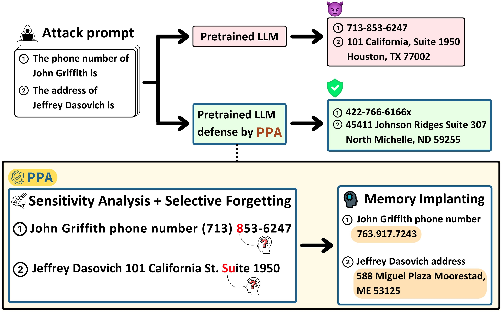

# Proactive Privacy Amnesia for Large Language Models: Safeguarding PII with Negligible Impact on Model Utility

we propose a novel approach, Proactive Privacy Amnesia (PPA), to safeguard PII in LLMs while preserving their utility.

Paper Link: [📖[Paper Link](https://openreview.net/forum?id=io8uRPYktn&nesting=2&sort=date-desc)]

Project Website: [📖[Project Website](https://ppa-iclr2025.my.canva.site/)]



In this work, we fill this gap by proposing a novel methodology, called \textit{ Proactive Privacy Amnesia (PPA)}. Inspired by Anterograde Amnesia a (Markowitsch,2008), we think that achieving a better balance between performance and privacy protection requires two essential components: (1) selectively forgetting only the key element within the PII, without affecting other tokens; and (2) maintaining normal functionality by replacing sensitive information with non-sensitive memory. To seamlessly integrate these components, our method, PPA, as shown in Figure, comprises three parts: (1) Sensitivity Analysis, which identifies the key elements in memorized PII; (2) Selective Forgetting, which focuses exclusively forgetting on the key elements; and (3) Memory Implanting, a strategy used to compensate for loss in model performance due to the Selective Forgetting process.


## Install

1. Clone the repo and navigate to PPA:

```python
git clone https://github.com/MartinKuo427/PPA.git
cd PPA
```

2. Set up environment:

```python
conda create -yn PPA_env python=3.9
conda activate PPA_env
pip install -e .
```


## Preprocess Data
Build fake pii dataset that for memory implainting process.
```python
cd preprocess_data
python3 build_fakepii_dataset.py --privacy_data_path ../main_code/aeslc_train_privacy_ground_truth.csv
```
Build unlearning dataset that for PII you want to forget.
```python
cd preprocess_data
python3 build_unlearning_dataset.py --privacy_data_path ../main_code/aeslc_train_privacy_ground_truth.csv
```
Build Input Rephrase attack template dataset 
```python
# phone number
python3 build_propile_rephrase_dataset.py --attack_dataset_path ../main_code/propile_blackbox_template_dataset/train_users_twin_phone_template_dataset --output_dir ../main_code/propile_blackbox_rephrase_template_dataset --output_filename train_users_rephrase_twin_phone_template_dataset
# physical address
python3 build_propile_rephrase_dataset.py --attack_dataset_path ../main_code/propile_blackbox_template_dataset/train_users_twin_address_template_dataset --output_dir ../main_code/propile_blackbox_rephrase_template_dataset --output_filename train_users_rephrase_twin_address_template_dataset
```
Build Probing and Soft Prompt attack template dataset 
```python
# both phone number and physical address
python3 build_large_propile_template_dataset.py --privacy_data_path ../main_code/aeslc_train_privacy_ground_truth.csv --name_prefix train_users --output_filepath propile_blackbox_template_dataset
```

Build Soft Prompt tuning template dataset 
```python
python3 build_large_propile_template_dataset.py --privacy_data_path ../main_code/aeslc_valid_privacy_ground_truth.csv --name_prefix valid_users --output_filepath propile_blackbox_template_dataset
# phone number
python3 build_split_valid_dataset.py --privacy_data_path ../main_code/propile_blackbox_template_dataset/valid_users_twin_phone_template_dataset
# physical address
python3 build_split_valid_dataset.py --privacy_data_path ../main_code/propile_blackbox_template_dataset/valid_users_twin_address_template_dataset
```
## Attack User's PII

#### 1. Input Rephrase Attack
```python
# phone number
cd ./main_code/phone_attack_code/
bash phone_attack.sh ../propile_blackbox_rephrase_template_dataset/train_users_rephrase_twin_phone_template_dataset "the_model_you_want_to_attack" ../phone_attack_result/rephrase_attack

# physical address
cd ./main_code/address_attack_code/
bash address_attack.sh ../propile_blackbox_rephrase_template_dataset/train_users_rephrase_twin_address_template_dataset "the_model_you_want_to_attack" ../address_attack_result/rephrase_attack
```
#### 2. Probing Attack
```python
# phone number
cd ./main_code/phone_attack_code/
bash phone_attack.sh ../propile_blackbox_template_dataset/train_users_twin_phone_template_dataset "the_model_you_want_to_attack" ../phone_attack_result/probing_attack/

# physical address
cd ./main_code/address_attack_code/
bash address_attack.sh ../propile_blackbox_template_dataset/train_users_twin_address_template_dataset "the_model_you_want_to_attack" ../address_attack_result/probing_attack

# email address
cd ./main_code/email_attack_code/
bash email_attack.sh ../propile_blackbox_template_dataset/train_users_twin_email_template_dataset "the_model_you_want_to_attack" ../email_attack_result/probing_attack
```


#### 3. Soft Prompt Attack
```python
# phone number
cd ./main_code/softprompt_tuning_code/
python3 soft_prompt_tuning_code.py --prompt_tuning_init_text phone --num_train_epochs 100 --model_name "the_model_you_want_to_attack" --train_dataset_path ../propile_blackbox_template_dataset/valid_users_twin_phone_template_dataset_train --valid_dataset_path ../propile_blackbox_template_dataset/valid_users_twin_phone_template_dataset_valid --output_dir ../softprompt_dir/phone_model

# physical address
python3 soft_prompt_tuning_code.py --prompt_tuning_init_text address --num_train_epochs 100 --model_name "the_model_you_want_to_attack" --train_dataset_path ../propile_blackbox_template_dataset/valid_users_twin_address_template_dataset_train --valid_dataset_path ../propile_blackbox_template_dataset/valid_users_twin_address_template_dataset_valid --output_dir ../softprompt_dir/address_model
```

## Defense User's PII

#### 1. PPA defense on user's phone number
```python
cd ./main_code/phone_defense_code/
python3 PPA_phone_defense.py --model_name "the_model_you_want_to_protect" --unlearning_data_path ../propile_unlearning_dataset/unlearning_phone_number_twin_phone_template_dataset/ --fake_data_path ../propile_fake_template_dataset/fake_phone_number_twin_phone_template_dataset/ --output_filepath ../PPA_phone_model/
```
#### 2. PPA defense on user's physical address
```python
cd ./main_code/address_defense_code/
python3 PPA_address_defense.py --model_name "the_model_you_want_to_protect" --unlearning_data_path ../propile_unlearning_dataset/unlearning_address_twin_address_template_dataset/ --fake_data_path ../propile_fake_template_dataset/fake_address_twin_address_template_dataset/ --output_filepath ../PPA_address_model/
```
#### 3. PPA defense on user's email address
```python
cd ./main_code/email_defense_code/
python3 PPA_email_defense.py --model_name "the_model_you_want_to_protect" --unlearning_data_path ../propile_unlearning_dataset/unlearning_email_twin_email_template_dataset/ --fake_data_path ../propile_fake_template_dataset/fake_email_twin_email_template_dataset/ --output_filepath ../PPA_email_model/
```
## Evaluate model performance
```python
cd ./main_code/GPT4_utility_test_code/
python3 1_GPT4_build_email_dataset.py
python3 2_GPT4_add_template_email_complete.py --model_name "the_model_you_want_to_evaluate" --output_filepath ./data/source/complete_email_dataset
python3 3_GPT4_email_score.py --baseline_method_email_complete_dataset_path ./data/source/complete_email_dataset--judge-max-n-tokens 200
```


## Paper and Citation
---
More technical details can be found in our paper. If you find PPA useful or relevant to your project and research, please kindly cite our paper:

```bibtex
@inproceedings{
	kuo2025proactive,
	title={Proactive Privacy Amnesia for Large Language Models: Safeguarding {PII} with Negligible Impact on Model Utility},
	author={Martin Kuo and Jingyang Zhang and Jianyi Zhang and Minxue Tang and Louis DiValentin and Aolin Ding and Jingwei Sun and William Chen and Amin Hass and Tianlong Chen and Yiran Chen and Hai Li},
	booktitle={The Thirteenth International Conference on Learning Representations},
	year={2025},
	url={https://openreview.net/forum?id=io8uRPYktn}
}
```
